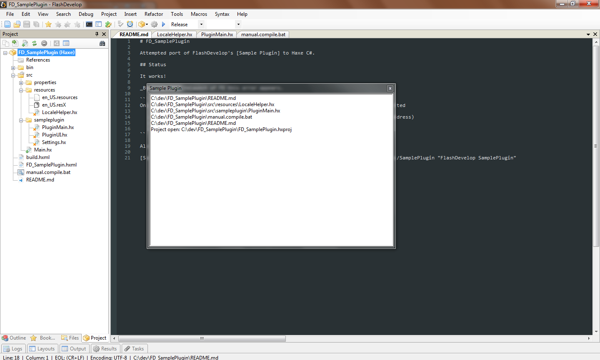

# FD_SamplePlugin

Attempted port of FlashDevelop's [Sample Plugin] to Haxe C#.

## Status

It works!

## Dependencies

- git
- Haxe `3.2.1`
- Visual Studio 2015 Community Edition
- My `hxcs` fork:
	- `haxelib git hxcs https://github.com/skial/hxcs.git fd_plugin_dll`

## Building

If you installed the dependencies to their default locations
you _should_ be set and able to type `haxe build.hxml`.

If you installed Visual Studio to an alternative location,
update `-D resgen` and `-D csc` to point to `Resgen.exe` and `csc.exe` respectively.

`csc.exe` needs to be from .Net Framework `3.5`. If you use `csc.exe` from
.Net Framework `4.0` you are likely to have errors later on.

Also update the paths to the listed `-net-lib` paths if you have to.

## Errors

If the `dll` is built with `-debug`, then its possible this error can appear.

```
Only one usage of each socket address (protocol/network address/port) is normally permitted

   at System.Net.Sockets.Socket.DoBind(EndPoint endPointSnapshot, SocketAddress socketAddress)
   at System.Net.Sockets.Socket.Bind(EndPoint localEP)
   at FlashConnect.XmlSocket..ctor(String address, Int32 port)
```

## Evidence!



[Sample Plugin]: https://github.com/fdorg/flashdevelop/tree/development/External/Plugins/SamplePlugin "FlashDevelop SamplePlugin"
